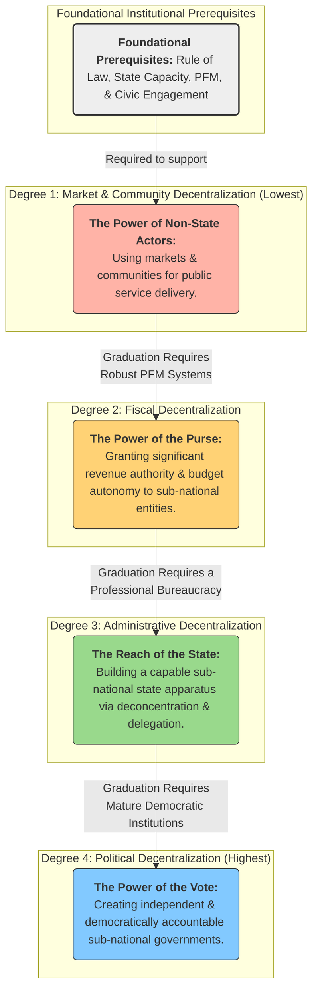

```mermaid
graph TD
    subgraph "Degree 4: Political Decentralization (Highest)"
        D4("<b>The Power of the Vote:</b><br>Creating independent & democratically accountable sub-national governments.")
    end
    subgraph "Degree 3: Administrative Decentralization"
        D3("<b>The Reach of the State:</b><br>Building a capable sub-national state apparatus via deconcentration & delegation.")
    end
    subgraph "Degree 2: Fiscal Decentralization"
        D2("<b>The Power of the Purse:</b><br>Granting significant revenue authority & budget autonomy to sub-national entities.")
    end
    subgraph "Degree 1: Market & Community Decentralization (Lowest)"
        D1("<b>The Power of Non-State Actors:</b><br>Using markets & communities for public service delivery.")
    end
    
    subgraph "Foundational Institutional Prerequisites"
        F("<b>Foundational Prerequisites:</b> Rule of Law, State Capacity, PFM, & Civic Engagement")
    end

    F -- "Required to support" --> D1
    D1 -- "Graduation Requires<br>Robust PFM Systems" --> D2
    D2 -- "Graduation Requires a<br>Professional Bureaucracy" --> D3
    D3 -- "Graduation Requires<br>Mature Democratic Institutions" --> D4

    style D4 fill:#82c9ff,stroke:#333
    style D3 fill:#99d98c,stroke:#333
    style D2 fill:#ffd275,stroke:#333
    style D1 fill:#ffb3a7,stroke:#333
    style F fill:#eee,stroke:#333,stroke-width:2px


```
