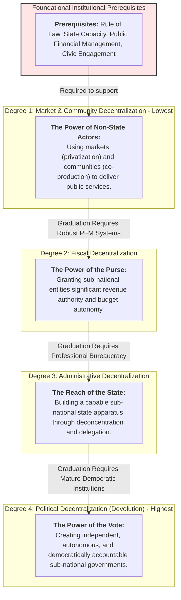

```mermaid
graph TD
    %% Degree 4
    subgraph G4["Degree 4: Political Decentralization (Devolution) - Highest"]
        D4["<b>The Power of the Vote:</b><br>Creating independent, autonomous, and democratically accountable sub-national governments."]
    end

    %% Degree 3
    subgraph G3["Degree 3: Administrative Decentralization"]
        D3["<b>The Reach of the State:</b><br>Building a capable sub-national state apparatus through deconcentration and delegation."]
    end

    %% Degree 2
    subgraph G2["Degree 2: Fiscal Decentralization"]
        D2["<b>The Power of the Purse:</b><br>Granting sub-national entities significant revenue authority and budget autonomy."]
    end

    %% Degree 1
    subgraph G1["Degree 1: Market & Community Decentralization - Lowest"]
        D1["<b>The Power of Non-State Actors:</b><br>Using markets (privatization) and communities (co-production) to deliver public services."]
    end
    
    %% Foundational prerequisites
    subgraph GF["Foundational Institutional Prerequisites"]
        F["<b>Prerequisites:</b> Rule of Law, State Capacity, Public Financial Management, Civic Engagement"]
    end

    %% Connections (between nodes, not subgraph labels)
    F -->|Required to support| D1
    D1 -->|Graduation Requires Robust PFM Systems| D2
    D2 -->|Graduation Requires Professional Bureaucracy| D3
    D3 -->|Graduation Requires Mature Democratic Institutions| D4

    %% Style only the prerequisite box differently (pink)
    style GF fill:#ffe6e6,stroke:#333,stroke-width:2px

```
