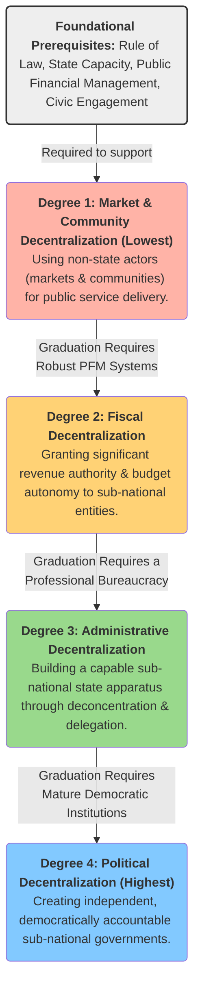

```mermaid
graph TD
    D4("<b>Degree 4: Political Decentralization (Highest)</b><br>Creating independent, democratically accountable sub-national governments.")
    D3("<b>Degree 3: Administrative Decentralization</b><br>Building a capable sub-national state apparatus through deconcentration & delegation.")
    D2("<b>Degree 2: Fiscal Decentralization</b><br>Granting significant revenue authority & budget autonomy to sub-national entities.")
    D1("<b>Degree 1: Market & Community Decentralization (Lowest)</b><br>Using non-state actors (markets & communities) for public service delivery.")
    
    F("<b>Foundational Prerequisites:</b> Rule of Law, State Capacity, Public Financial Management, Civic Engagement")

    F -- "Required to support" --> D1
    D1 -- "Graduation Requires<br>Robust PFM Systems" --> D2
    D2 -- "Graduation Requires a<br>Professional Bureaucracy" --> D3
    D3 -- "Graduation Requires<br>Mature Democratic Institutions" --> D4

    style D4 fill:#82c9ff
    style D3 fill:#99d98c
    style D2 fill:#ffd275
    style D1 fill:#ffb3a7
    style F fill:#eee,stroke:#333,stroke-width:2px
```
