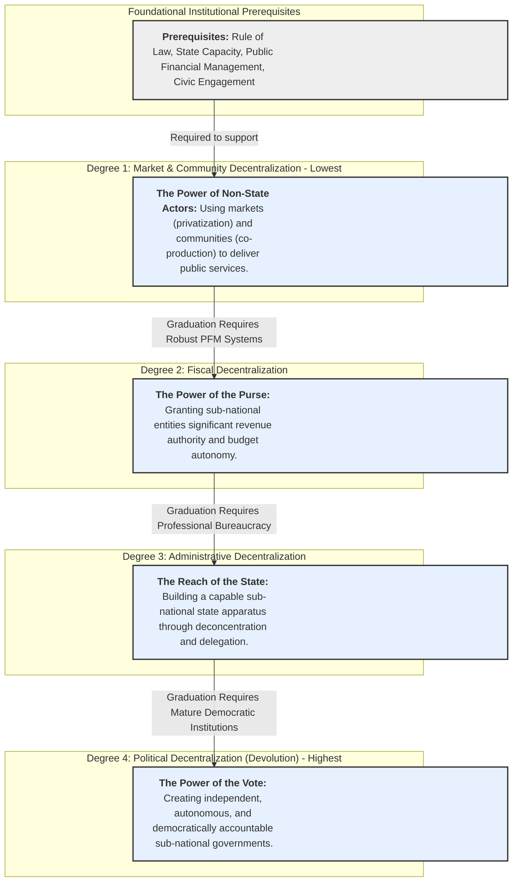

```mermaid
graph TD
    %% Degree 4
    subgraph "Degree 4: Political Decentralization (Devolution) - Highest"
        D4["<b>The Power of the Vote:</b> Creating independent, autonomous, and democratically accountable sub-national governments."]
    end

    %% Degree 3
    subgraph "Degree 3: Administrative Decentralization"
        D3["<b>The Reach of the State:</b> Building a capable sub-national state apparatus through deconcentration and delegation."]
    end

    %% Degree 2
    subgraph "Degree 2: Fiscal Decentralization"
        D2["<b>The Power of the Purse:</b> Granting sub-national entities significant revenue authority and budget autonomy."]
    end

    %% Degree 1
    subgraph "Degree 1: Market & Community Decentralization - Lowest"
        D1["<b>The Power of Non-State Actors:</b> Using markets (privatization) and communities (co-production) to deliver public services."]
    end
    
    %% Prerequisites
    subgraph "Foundational Institutional Prerequisites"
        F["<b>Prerequisites:</b> Rule of Law, State Capacity, Public Financial Management, Civic Engagement"]
    end

    %% Arrows
    F -->|Required to support| D1
    D1 -->|Graduation Requires Robust PFM Systems| D2
    D2 -->|Graduation Requires Professional Bureaucracy| D3
    D3 -->|Graduation Requires Mature Democratic Institutions| D4

    %% Style (widen nodes so text stays on one line)
    style F  fill:#eee,stroke:#333,stroke-width:2px,width:600px
    style D1 fill:#e6f0ff,stroke:#333,stroke-width:2px,width:600px
    style D2 fill:#e6f0ff,stroke:#333,stroke-width:2px,width:600px
    style D3 fill:#e6f0ff,stroke:#333,stroke-width:2px,width:600px
    style D4 fill:#e6f0ff,stroke:#333,stroke-width:2px,width:600px

```
