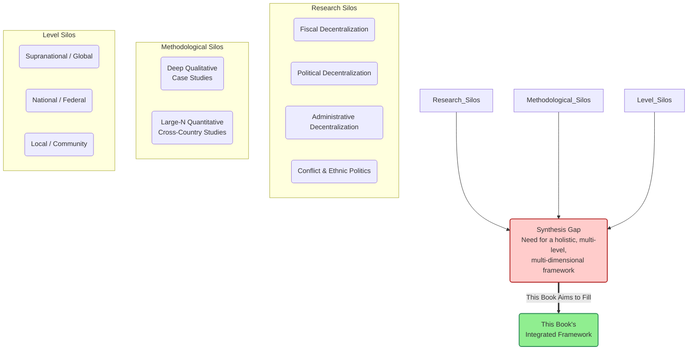

```mermaid
graph TD
    subgraph Research Silos
        direction LR
        A(Fiscal Decentralization<br><i>)
        B(Political Decentralization<br><i>)
        C(Administrative Decentralization<br><i>)
        D(Conflict & Ethnic Politics<br><i>)
    end

    subgraph Methodological Silos
        direction LR
        E(Deep Qualitative<br>Case Studies<br><i>)
        F(Large-N Quantitative<br>Cross-Country Studies<br><i>)
    end

    subgraph Level Silos
        direction LR
        G(Supranational / Global<br><i>)
        H(National / Federal<br><i>)
        I(Local / Community<br><i>)
    end

    Gap(Synthesis Gap<br>Need for a holistic, multi-level,<br>multi-dimensional framework)

    Research_Silos --> Gap
    Methodological_Silos --> Gap
    Level_Silos --> Gap

    Gap ==>|This Book Aims to Fill| Book(This Book's<br>Integrated Framework)

    style Gap fill:#ffcccb,stroke:#b22222,stroke-width:2px
    style Book fill:#90ee90,stroke:#2e8b57,stroke-width:2px
```
