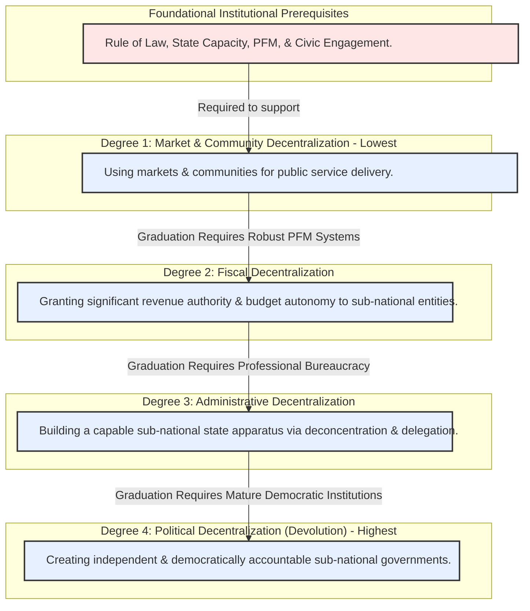

```mermaid
%%{init: {'themeCSS': '.label foreignObject span { white-space: nowrap; text-align: center; }'}}%%
graph TD
    %% Degree 4
    subgraph "Degree 4: Political Decentralization (Devolution) - Highest"
        D4["Creating independent & democratically accountable sub-national governments."]
    %% Styling (uniform widths, centered)
end

    %% Degree 3
    subgraph "Degree 3: Administrative Decentralization"
        D3["Building a capable sub-national state apparatus via deconcentration & delegation."]
    %% Styling (uniform widths, centered)
end

    %% Degree 2
    subgraph "Degree 2: Fiscal Decentralization"
        D2["Granting significant revenue authority & budget autonomy to sub-national entities."]
    %% Styling (uniform widths, centered)
end

    %% Degree 1
    subgraph "Degree 1: Market & Community Decentralization - Lowest"
        D1["Using markets & communities for public service delivery."]
    %% Styling (uniform widths, centered)
end

    %% Prerequisites
    subgraph "Foundational Institutional Prerequisites"
        F["Rule of Law, State Capacity, PFM, & Civic Engagement."]
        %% Styling (uniform widths, centered)
end

    %% Arrows
    F -->|Required to support| D1
    D1 -->|Graduation Requires Robust PFM Systems| D2
    D2 -->|Graduation Requires Professional Bureaucracy| D3
    D3 -->|Graduation Requires Mature Democratic Institutions| D4

    %% Styling (uniform widths, centered)
    style F  fill:#ffe6e6,stroke:#333,stroke-width:2px,width:600px
    style D1 fill:#e6f0ff,stroke:#333,stroke-width:2px,width:600px
    style D2 fill:#e6f0ff,stroke:#333,stroke-width:2px,width:600px
    style D3 fill:#e6f0ff,stroke:#333,stroke-width:2px,width:600px
    style D4 fill:#e6f0ff,stroke:#333,stroke-width:2px,width:600px
```
