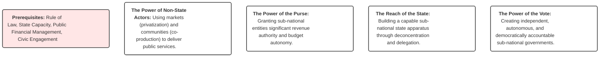

```mermaid
graph LR
    %% Left side: prerequisites
    F("<b>Prerequisites:</b> Rule of Law, State Capacity, Public Financial Management, Civic Engagement")

    %% Right side: four degrees stacked downward
    D1("<b>The Power of Non-State Actors:</b> Using markets (privatization) and communities (co-production) to deliver public services.")
    D2("<b>The Power of the Purse:</b> Granting sub-national entities significant revenue authority and budget autonomy.")
    D3("<b>The Reach of the State:</b> Building a capable sub-national state apparatus through deconcentration and delegation.")
    D4("<b>The Power of the Vote:</b> Creating independent, autonomous, and democratically accountable sub-national governments.")

    %% Positioning → sideways U shape
    F --- D1
    D1 --> D2
    D2 --> D3
    D3 --> D4

    %% Styling: wide boxes, auto-height
    style F  width:350px,fill:#ffe6e6,stroke:#333,stroke-width:2px
    style D1 width:350px,fill:#fff,stroke:#333,stroke-width:2px
    style D2 width:350px,fill:#fff,stroke:#333,stroke-width:2px
    style D3 width:350px,fill:#fff,stroke:#333,stroke-width:2px
    style D4 width:350px,fill:#fff,stroke:#333,stroke-width:2px
```
