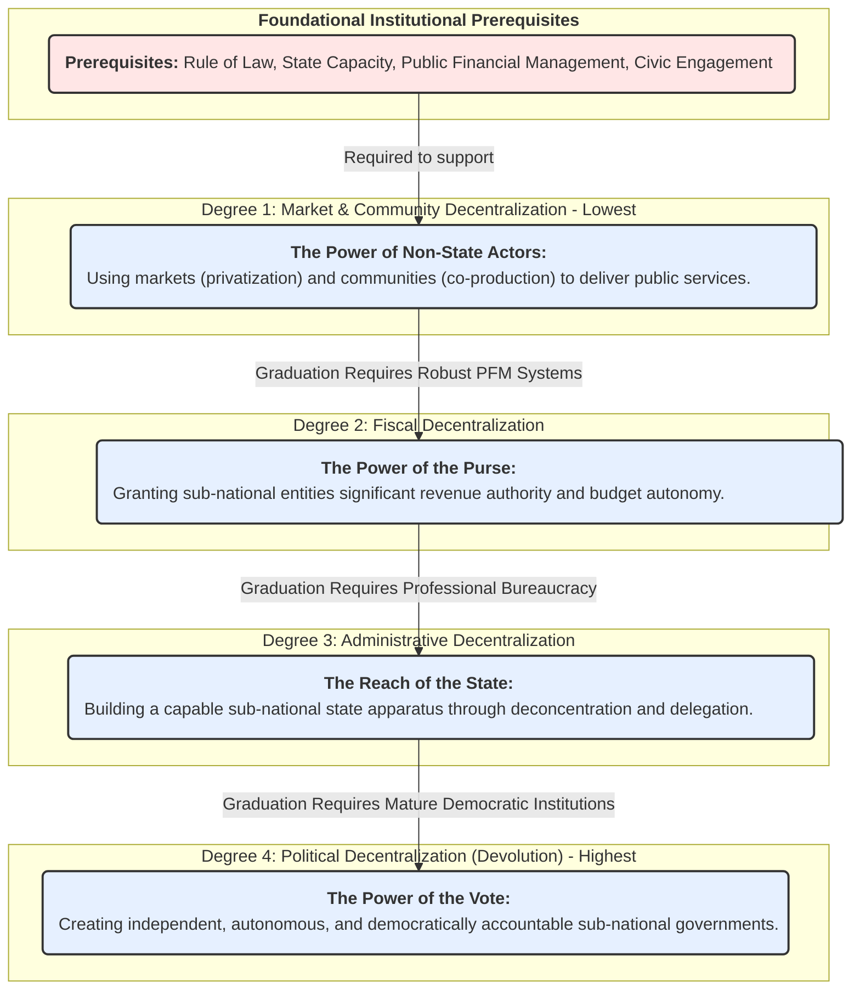

```mermaid
%%{init: {'themeCSS': '.label foreignObject span { white-space: nowrap; text-align: center; }'}}%%
graph TD
    subgraph "Degree 4: Political Decentralization (Devolution) - Highest"
        D4("<b>The Power of the Vote:</b><br>Creating independent, autonomous, and democratically accountable sub-national governments.")
    end
    subgraph "Degree 3: Administrative Decentralization"
        D3("<b>The Reach of the State:</b><br>Building a capable sub-national state apparatus through deconcentration and delegation.")
    end
    subgraph "Degree 2: Fiscal Decentralization"
        D2("<b>The Power of the Purse:</b><br>Granting sub-national entities significant revenue authority and budget autonomy.")
    end
    subgraph "Degree 1: Market & Community Decentralization - Lowest"
        D1("<b>The Power of Non-State Actors:</b><br>Using markets (privatization) and communities (co-production) to deliver public services.")
    end
    
    subgraph "<b>Foundational Institutional Prerequisites</b><br>"
        F("<b>Prerequisites:</b> Rule of Law, State Capacity, Public Financial Management, Civic Engagement")
    end

    F -- "Required to support" --> D1
    D1 -- "Graduation Requires Robust PFM Systems" --> D2
    D2 -- "Graduation Requires Professional Bureaucracy" --> D3
    D3 -- "Graduation Requires Mature Democratic Institutions" --> D4

    %% Styling (uniform widths, centered)
    style F  fill:#ffe6e6,stroke:#333,stroke-width:2px,width:700px
    style D1 fill:#e6f0ff,stroke:#333,stroke-width:2px,width:700px
    style D2 fill:#e6f0ff,stroke:#333,stroke-width:2px,width:700px
    style D3 fill:#e6f0ff,stroke:#333,stroke-width:2px,width:700px
    style D4 fill:#e6f0ff,stroke:#333,stroke-width:2px,width:700px
```
