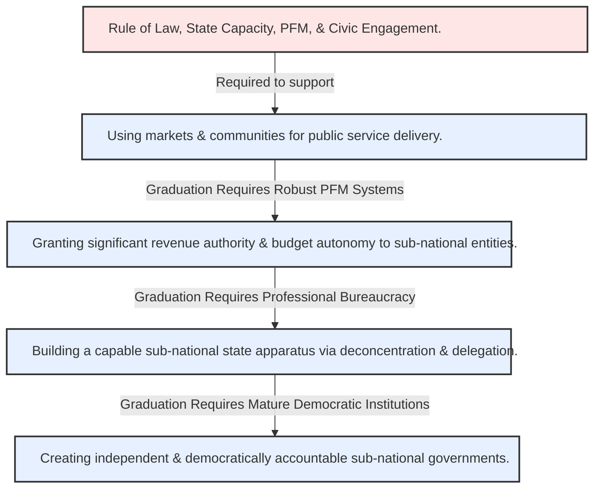

```mermaid
%%{init: {'themeCSS': '.label foreignObject span { text-align: center; white-space: nowrap; }'}}%%
graph TD
    %% Nodes (all single line)
    F["Rule of Law, State Capacity, PFM, & Civic Engagement."]
    D1["Using markets & communities for public service delivery."]
    D2["Granting significant revenue authority & budget autonomy to sub-national entities."]
    D3["Building a capable sub-national state apparatus via deconcentration & delegation."]
    D4["Creating independent & democratically accountable sub-national governments."]

    %% Arrows
    F -->|Required to support| D1
    D1 -->|Graduation Requires Robust PFM Systems| D2
    D2 -->|Graduation Requires Professional Bureaucracy| D3
    D3 -->|Graduation Requires Mature Democratic Institutions| D4

    %% Styling (all centered, same width)
    style F  fill:#ffe6e6,stroke:#333,stroke-width:2px,width:600px
    style D1 fill:#e6f0ff,stroke:#333,stroke-width:2px,width:600px
    style D2 fill:#e6f0ff,stroke:#333,stroke-width:2px,width:600px
    style D3 fill:#e6f0ff,stroke:#333,stroke-width:2px,width:600px
    style D4 fill:#e6f0ff,stroke:#333,stroke-width:2px,width:600px
```
