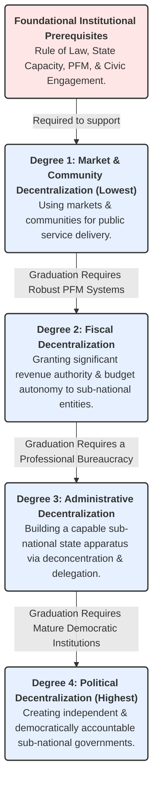

```mermaid
graph TD
    %% Define Nodes
    D4("<b>Degree 4: Political Decentralization (Highest)</b><br>Creating independent & democratically accountable sub-national governments.")
    D3("<b>Degree 3: Administrative Decentralization</b><br>Building a capable sub-national state apparatus via deconcentration & delegation.")
    D2("<b>Degree 2: Fiscal Decentralization</b><br>Granting significant revenue authority & budget autonomy to sub-national entities.")
    D1("<b>Degree 1: Market & Community Decentralization (Lowest)</b><br>Using markets & communities for public service delivery.")
    F("<b>Foundational Institutional Prerequisites</b><br>Rule of Law, State Capacity, PFM, & Civic Engagement.")

    %% Define Links
    F -->|Required to support| D1
    D1 -->|Graduation Requires Robust PFM Systems| D2
    D2 -->|Graduation Requires a Professional Bureaucracy| D3
    D3 -->|Graduation Requires Mature Democratic Institutions| D4

    %% Styling
    style F fill:#ffe6e6,stroke:#333,stroke-width:2px
    style D1 fill:#e6f0ff,stroke:#333,stroke-width:2px
    style D2 fill:#e6f0ff,stroke:#333,stroke-width:2px
    style D3 fill:#e6f0ff,stroke:#333,stroke-width:2px
    style D4 fill:#e6f0ff,stroke:#333,stroke-width:2px
```
