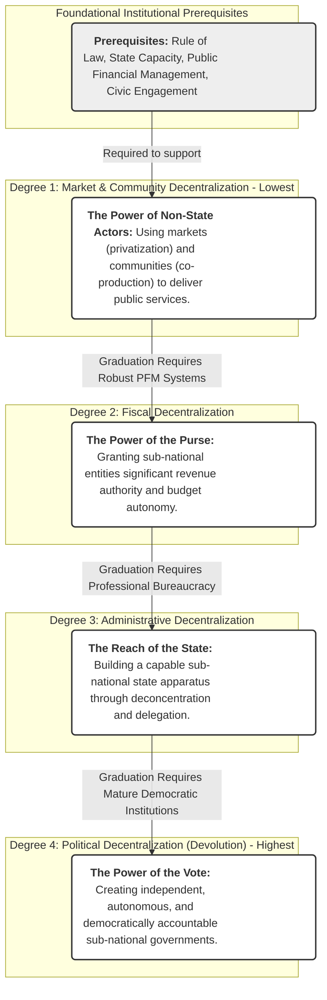

```mermaid
graph TD
    %% Make nodes wider (so they look shorter in height)
    %% Remove manual "height" to avoid overlaps
    subgraph "Degree 4: Political Decentralization (Devolution) - Highest"
        D4("<b>The Power of the Vote:</b> Creating independent, autonomous, and democratically accountable sub-national governments.")
    end
    subgraph "Degree 3: Administrative Decentralization"
        D3("<b>The Reach of the State:</b> Building a capable sub-national state apparatus through deconcentration and delegation.")
    end
    subgraph "Degree 2: Fiscal Decentralization"
        D2("<b>The Power of the Purse:</b> Granting sub-national entities significant revenue authority and budget autonomy.")
    end
    subgraph "Degree 1: Market & Community Decentralization - Lowest"
        D1("<b>The Power of Non-State Actors:</b> Using markets (privatization) and communities (co-production) to deliver public services.")
    end
    
    subgraph "Foundational Institutional Prerequisites"
        F("<b>Prerequisites:</b> Rule of Law, State Capacity, Public Financial Management, Civic Engagement")
    end

    F -- "Required to support" --> D1
    D1 -- "Graduation Requires Robust PFM Systems" --> D2
    D2 -- "Graduation Requires Professional Bureaucracy" --> D3
    D3 -- "Graduation Requires Mature Democratic Institutions" --> D4

    %% Styling: widen nodes so they become shorter
    style D1 width:350px,fill:#fff,stroke:#333,stroke-width:2px
    style D2 width:350px,fill:#fff,stroke:#333,stroke-width:2px
    style D3 width:350px,fill:#fff,stroke:#333,stroke-width:2px
    style D4 width:350px,fill:#fff,stroke:#333,stroke-width:2px
    style F  width:350px,fill:#eee,stroke:#333,stroke-width:2px
```
