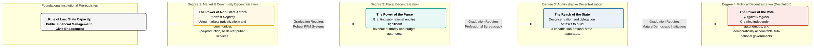

```mermaid
%%{init: {
  "flowchart": { "nodeSpacing": 80, "rankSpacing": 120, "useMaxWidth": false },
  "themeVariables": { "fontSize": "13px", "lineHeight": 1.2 }
}}%%
graph LR
    %% Degrees
    subgraph "Degree 1: Market & Community Decentralization"
        D1("<b>The Power of Non-State Actors</b><br><i>(Lowest Degree)</i><br>Using markets (privatization) and communities<br>(co-production) to deliver public services.")
    end
    subgraph "Degree 2: Fiscal Decentralization"
        D2("<b>The Power of the Purse</b><br>Granting sub-national entities significant<br>revenue authority and budget autonomy.")
    end
    subgraph "Degree 3: Administrative Decentralization"
        D3("<b>The Reach of the State</b><br>Deconcentration and delegation of tasks to build<br>a capable sub-national state apparatus.")
    end
    subgraph "Degree 4: Political Decentralization (Devolution)"
        D4("<b>The Power of the Vote</b><br><i>(Highest Degree)</i><br>Creating independent, autonomous, and<br>democratically accountable sub-national governments.")
    end
    
    %% Foundations
    subgraph "Foundational Institutional Prerequisites"
        F("<b>Rule of Law, State Capacity,<br>Public Financial Management, Civic Engagement</b>")
    end

    %% Links
    F --- D1
    D1 -- "Graduation Requires<br>Robust PFM Systems" --> D2
    D2 -- "Graduation Requires<br>Professional Bureaucracy" --> D3
    D3 -- "Graduation Requires<br>Mature Democratic Institutions" --> D4

    %% Styling
    classDef deg1 fill:#fef9e7,stroke:#d4ac0d,stroke-width:2px,color:#000,width:320px,height:80px
    classDef deg2 fill:#e8f8f5,stroke:#16a085,stroke-width:2px,color:#000,width:320px,height:80px
    classDef deg3 fill:#eaf2f8,stroke:#2471a3,stroke-width:2px,color:#000,width:320px,height:80px
    classDef deg4 fill:#fceae8,stroke:#c0392b,stroke-width:2px,color:#000,width:320px,height:80px
    classDef foundation fill:#f5f5f5,stroke:#333,stroke-width:2px,color:#000,width:420px,height:70px

    class D1 deg1
    class D2 deg2
    class D3 deg3
    class D4 deg4
    class F foundation
```
