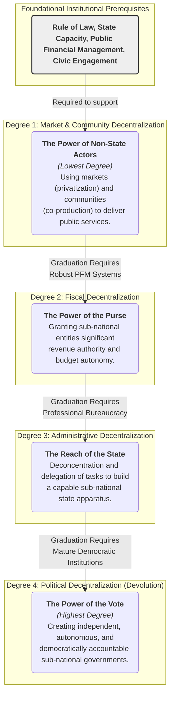

```mermaid
graph TD
    subgraph "Degree 4: Political Decentralization (Devolution)"
        D4("<b>The Power of the Vote</b><br><i>(Highest Degree)</i><br>Creating independent, autonomous, and<br>democratically accountable sub-national governments.")
    end
    subgraph "Degree 3: Administrative Decentralization"
        D3("<b>The Reach of the State</b><br>Deconcentration and delegation of tasks to build<br>a capable sub-national state apparatus.")
    end
    subgraph "Degree 2: Fiscal Decentralization"
        D2("<b>The Power of the Purse</b><br>Granting sub-national entities significant<br>revenue authority and budget autonomy.")
    end
    subgraph "Degree 1: Market & Community Decentralization"
        D1("<b>The Power of Non-State Actors</b><br><i>(Lowest Degree)</i><br>Using markets (privatization) and communities<br>(co-production) to deliver public services.")
    end
    
    subgraph "Foundational Institutional Prerequisites"
        F("<b>Rule of Law, State Capacity, Public Financial Management, Civic Engagement</b>")
    end

    F -- "Required to support" --> D1
    D1 -- "Graduation Requires<br>Robust PFM Systems" --> D2
    D2 -- "Graduation Requires<br>Professional Bureaucracy" --> D3
    D3 -- "Graduation Requires<br>Mature Democratic Institutions" --> D4

    style F fill:#eee,stroke:#333,stroke-width:2px

```
